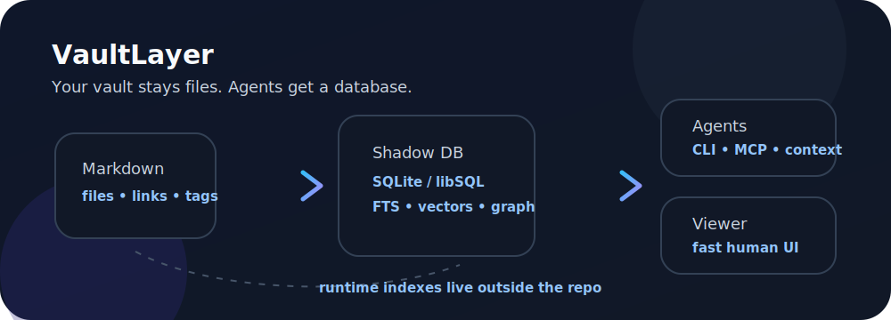

<picture>
  <source media="(prefers-color-scheme: dark)" srcset="assets/hero.svg">
  
</picture>

# VaultLayer

[](#status)
[](LICENSE)
[](#verify)

**VaultLayer is a local-first database and retrieval layer for huge Markdown/Obsidian vaults.**

Your vault stays plain files. VaultLayer builds a rebuildable shadow database with metadata, WikiLinks, FTS, vectors, citations, human relevance scores, CLI, and MCP tools so humans and agents do not have to crawl 100k notes every time.

## Status

Early public MVP. Useful for experiments and architecture work; not production-stable yet.

## Why

Obsidian is excellent as a human writing surface, but very large vaults need a fast read model. Agents also need bounded, cited, queryable context instead of broad filesystem scans.

VaultLayer provides the shared engine:

```text
Markdown/Obsidian vault -> VaultLayer index DB -> CLI/MCP/Viewer
```

## Quick start

```bash
git clone https://github.com/viggomeesters/vault-layer.git
cd vault-layer
make check
cargo run -p vault-layer -- --help
```

Index a small synthetic or local test vault:

```bash
cargo run -p vault-layer -- index /path/to/vault --state-dir ~/.local/share/vault-layer --limit 20
```

Inspect the configured storage backend:

```bash
cargo run -p vault-layer -- backend-info

# Recommended local SQLite + FTS5 retrieval projection, no credentials/network
cargo run -p vault-layer -- index /path/to/vault

# Optional DuckDB analytics/export sidecar
VAULT_LAYER_BACKEND=duckdb cargo run -p vault-layer -- index /path/to/vault

# Explicit remote sync to hosted Turso/libSQL (requires real credentials)
TURSO_DATABASE_URL=libsql://your-database.turso.io \
TURSO_AUTH_TOKEN=*** \
cargo run -p vault-layer -- sync-turso /path/to/vault --limit 100
```

Local SQLite + FTS5 is the implemented primary retrieval default. `TURSO_DATABASE_URL` / `TURSO_AUTH_TOKEN` can be configured for the Turso/libSQL target, but remote sync only runs through explicit `sync-turso` / `index --remote-sync`; VaultLayer will not upload private vault text by accident.

Search with citations:

```bash
vault-layer search "agent context" --db ~/.local/share/vault-layer/<vault-id>/vault-layer.db --json
vault-layer get-note "Projects/example.md" --db <db> --json
vault-layer related "Projects/example.md" --db <db> --json
```

Generate local embeddings and run vector retrieval:

```bash
# deterministic smoke/test provider
vault-layer embed --db <db> --model deterministic-v0

# real local ONNX model via Python fastembed; cache stays outside repo/vault
python3 -m pip install fastembed==0.7.3
vault-layer embed --db <db> --model fastembed-mini-lm
vault-layer vector-search "agent context" --db <db> --model fastembed-mini-lm --json
```

MCP smoke interface:

```bash
vault-layer serve --mcp --list-tools
vault-layer serve --mcp --call vault_search --query "agent" --db <db>
```

## Safety boundary

VaultLayer treats the source vault as read-only by default.

- Do **not** commit private vault content.
- Do **not** commit generated DB/index/embedding files.
- Runtime state belongs outside both the repo and the vault, e.g. `~/.local/share/vault-layer/`.
- Examples and tests must use synthetic fixtures.
- Writeback is disabled in the MVP.
- SQLite + FTS5 is the recommended/default local retrieval backend over `.md` while the vault remains source of truth.
- sqlite-vec is the intended native local vector path; deterministic JSON cosine remains the fallback until packaging is proven.
- DuckDB is an optional analytics/export sidecar: set `VAULT_LAYER_BACKEND=duckdb`.
- Hosted Turso/libSQL is treated as cloud/sync/export target, not the local core.

## Product split

- **VaultLayer core** — parser, stable IDs, shadow DB, search, vectors, provenance, human relevance scores.
- **VaultLayer CLI/MCP** — agent and automation surface.
- **Mega Vault Viewer** — human UI consumer of VaultLayer read models.

See [`docs/viewer-adapter.md`](docs/viewer-adapter.md).

## Docs

- [`docs/ARCHITECTURE.md`](docs/ARCHITECTURE.md)
- [`docs/api.md`](docs/api.md)
- [`docs/embeddings.md`](docs/embeddings.md)
- [`docs/mcp.md`](docs/mcp.md)
- [`docs/wsl-smoke.md`](docs/wsl-smoke.md)
- [`docs/ROADMAP.md`](docs/ROADMAP.md)
- [`docs/REPO_COMPLETE.md`](docs/REPO_COMPLETE.md)
- [`docs/FILL_LOOP.md`](docs/FILL_LOOP.md)
- [`docs/local-embedding-adapter.md`](docs/local-embedding-adapter.md)
- [`docs/local-embedding-adapter-blocker.md`](docs/local-embedding-adapter-blocker.md)

## Verify

```bash
make check
```

The gate runs Rust checks/tests, repository safety guard, Python guard tests, `git diff --check`, and a generated-artifact tracking check.

## Package

```bash
cargo build --release -p vault-layer
./target/release/vault-layer --help
```

See [`docs/PACKAGE.md`](docs/PACKAGE.md).

## Contributing

Read [`CONTRIBUTORS.md`](CONTRIBUTORS.md), [`SUPPORT.md`](SUPPORT.md), [`SECURITY.md`](SECURITY.md), and [`AGENTS.md`](AGENTS.md). Keep all fixtures synthetic and all runtime artifacts outside Git.

## License

MIT. See [`LICENSE`](LICENSE).


## Backend decision

The accepted backend decision is documented in `docs/ADR-0001-primary-retrieval-backend.md`; benchmark evidence lives in `docs/backend-decision-benchmark.md`.


## sqlite-vec status

Native sqlite-vec is feasible and now has a scoped Rust/rusqlite smoke adapter exposed via `vault-layer sqlite-vec-info`; see `docs/sqlite-vec-packaging-spike.md`. Current production vector search keeps deterministic JSON cosine as the portable fallback until sqlite-vec tables are wired into the indexed vault DB.


## Retrieval benchmark evidence

Current bounded real-vault retrieval benchmark evidence lives in `docs/full-vault-retrieval-benchmark.md`. The full-vault WSL gate is intentionally not treated as unattended-green until progress/resume hardening exists.


## Retrieval quality

Vector fallback results now expose `cosine_score` and `text_quality_score` so low-information chunks can be demoted while native sqlite-vec and real embeddings mature. See `docs/retrieval-quality-first-pass.md`.


## Hybrid retrieval

`vault-layer embed` now refreshes native sqlite-vec rows when available, `vector-search` prefers native sqlite-vec KNN, and `hybrid-search` reranks FTS candidates with vector, human relevance, and text-quality signals. The current embedding model remains `deterministic-v0`; real local embeddings are a separate adapter layer. See `docs/sqlite-vec-hybrid-retrieval.md`.
